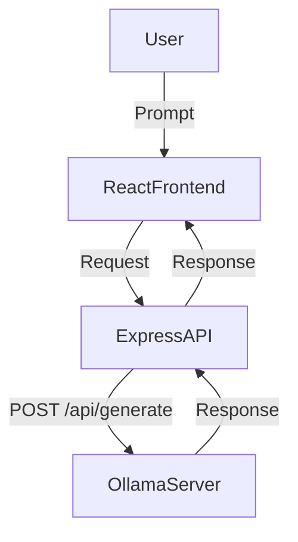

# 🤖 AI-Powered Interview Preparation Bot

An intelligent full-stack application that generates customized interview questions for different job roles using local LLMs (like `gemma:2b` via Ollama), with optional voice integration.

---

## 🚀 Features

- 🔍 Role-based interview question generation
- 🧠 Powered by **Gemma 2B LLM** using **Ollama** (offline & free)
- 🎤 (Optional) Voice input/output using **Whisper** and **Text-to-Speech**
- 💻 Built with **MERN stack** (MongoDB, Express.js, React, Node.js)

---

## 🛠 Tech Stack

| Layer     | Tech                     |
|-----------|--------------------------|
| Frontend  | React, Tailwind CSS      |
| Backend   | Node.js, Express.js      |
| AI Model  | Gemma 2B via Ollama      |
| LLM Host  | Ollama (local server)    |
| Extras    | Axios, Postman (testing) |

---

## 🧩 System Architecture



---

## 📦 Installation Guide

### 1. Clone the Repository

```bash
git clone https://github.com/yourusername/interview-prep-bot.git
cd interview-prep-bot
```

### 2. Install Backend Dependencies

```bash
cd backend
npm install
```

### 3. Install Frontend Dependencies

```bash
cd ../frontend
npm install
```

---

## 🤖 Ollama Setup

> Ollama is a free local LLM server that runs models like `mistral`, `gemma`, etc.

### ✅ Step-by-Step (Linux/Windows WSL)

1. Download & install Ollama from [https://ollama.com/download](https://ollama.com/download)  
2. Start Ollama server:

```bash
OLLAMA_HOST=localhost ollama serve
```

3. Pull the `gemma:2b` model:

```bash
ollama pull gemma:2b
```

4. Run the model (keep this terminal open):

```bash
ollama run gemma:2b
```

---

## ▶️ Run the App

### Start Backend

```bash
cd backend
node index.js
```

### Start Frontend

```bash
cd frontend
npm run dev
```

---

## 📡 API Endpoint

### POST `/api/questions`

**Request Body:**
```json
{
  "role": "Frontend Developer"
}
```

**Response:**
```json
{
  "questions": [
    "1. What is the Virtual DOM in React?",
    "2. Describe your approach to optimizing a web page.",
    ...
  ]
}
```

---

## 💻 Sample Backend Code

```js
app.post('/api/questions', async (req, res) => {
  const { role } = req.body;

  try {
    const ollamaRes = await axios.post('http://localhost:11434/api/generate', {
      model: 'gemma:2b',
      prompt: `Ask 10 interview questions for a ${role} role. Include technical and behavioral.`,
      stream: false
    });

    const responseText = ollamaRes.data.response;
    const questions = responseText.split('\n').filter(q => q.trim() !== '');

    res.json({ questions });
  } catch (err) {
    res.status(500).json({ error: 'Failed to generate questions', detail: err.message });
  }
});
```

---

## 🧠 Sample Prompt

```
Ask 10 interview questions for a Full Stack Developer role. Include technical and behavioral.
```

---

## 🎯 Future Enhancements

- ✅ Add voice input via Whisper
- ✅ Add text-to-speech for answers
- ✅ Rate answers using AI feedback
- ✅ Add real-time chat interface
- ✅ Track confidence level & generate improvement tips

---

## 🙌 Credits

- [Ollama](https://ollama.com/)
- [Meta Gemma 2B Model](https://ollama.com/library/gemma)
- [Node.js](https://nodejs.org/)
- [React](https://reactjs.org/)
- [MongoDB](https://mongodb.com/)
- [Whisper (optional)](https://github.com/openai/whisper)

---

## 📄 License

This project is open-source and available under the [MIT License](LICENSE).